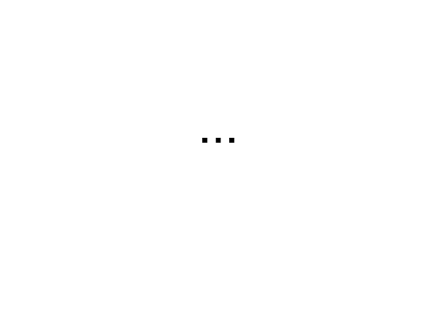
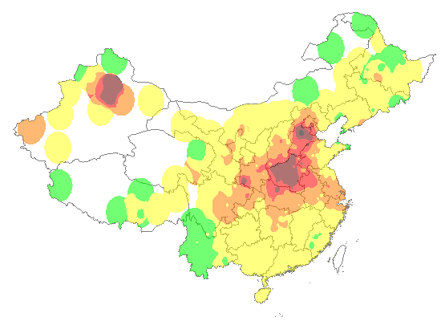

# 污染指数爬虫

定期爬污染分布图，保存并展示

## 环境依赖

1. linux
2. python
3. convert

## 运行说明

1. 修改路径

 偷懒，把路径都写死了。搜索 reactshare 可以找到全部路径，改成你自己的。

2. crontab 里面定时执行 crawl.py

 crawl.py 做两件事：(1) 爬当前污染图片并保存到 images 目录 (2) 调用 animate.sh 脚本把 images 目录下的全部 png 文件合成为 gif 动画

3. web 展示依赖 index.php

 整个项目请放到一个 web 服务器目录下，要求支持 php 运行。 index.php 自动扫描 images 目录下全部 png 文件，并展示。

## TODO

1. index.php 只展示最近图片，避免日久天长图片过多，耗费流量。

2. 只使用最近一周的图片来合成动画。生成高速动画版，低速动画版两个版本。速度不同，对污染扩散的态势感知效果也不同。

---

2016-12-29 by raywill
